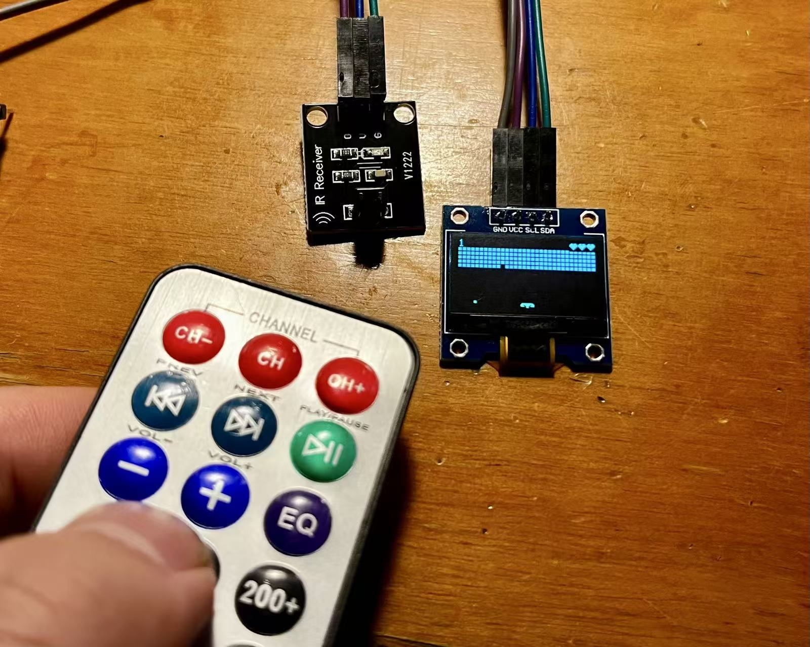

# this is a project to learn queue 

## 问题分析
```c
	//if (0 == IRReceiver_Read(&dev, &data)) 
```
-  使用环形缓冲区的判断太过于占用cpu资源，因此使用queue的方式进行
```c
		if (pdPASS == xQueueReceive(g_xQueuePlatform, &idata, portMAX_DELAY))
        {
            //"任务。。。"
        }
        ///使用队列，优化cpu调度
```
---

> https://rtos.100ask.net/zh/FreeRTOS/DShanMCU-F103/chapter11.html
> 参考这个教程进行的
##  步骤
> 创建游戏之前，默认任务是关闭的，重新创建了game游戏
### 1.创建queue（在游戏任务中创建队列）
```c
QueueHandle_t g_xQueuePlatform; /* 挡球板队列 */
 struct input_data idata;  /*接收数据的结构体*/

 //接收数据的结构体在外部函数中
 struct input_data {
	uint32_t dev;
	uint32_t val  
};

void game1_task(void *params)
{		
    uint8_t dev, data, last_data;
    
    g_framebuffer = LCD_GetFrameBuffer(&g_xres, &g_yres, &g_bpp);
    draw_init();
    draw_end();
	
	/* 创建队列:平台任务从里面读到红外数据,... */
	 g_xQueuePlatform = xQueueCreate(10, sizeof(struct input_data));

    剩余代码 。。。
```
---
## 2.Infiread receiver ISR：在红外接收中断中，将接收到的值写入队列
```c
	/* 3. 次数达标后, 解析数据, 放入buffer */
	if (g_IRReceiverIRQ_Cnt == 4)
	{
		/* 是否重复码 */
		if (isRepeatedKey())
		{
			/* device: 0, val: 0, 表示重复码 */
			//PutKeyToBuf(0);
			//PutKeyToBuf(0);  
			
			/* 写队列 */
			idata.dev = 0;
			idata.val = 0;
			//xQueueSend(g_xQueuePlatform, &idata, NULL); 不能使用这个函数，而应该用下面的在中断中使用的函数
			xQueueSendToBackFromISR(g_xQueuePlatform, &idata, NULL);
			g_IRReceiverIRQ_Cnt = 0;
		}
	}
```
## 3.PlatformTask :读队列
```c
 while (1)
    {
        /* 读取红外遥控器 */
		//if (0 == IRReceiver_Read(&dev, &data))
		if (pdPASS == xQueueReceive(g_xQueuePlatform, &idata, portMAX_DELAY))
		{
					  data = idata.val;
            if (data == 0x00)
            {
                data = last_data;
            }
            
            if (data == 0xe0) /* Left */
            {
                btnLeft();
            }

            ...等等任务。。。
```

